# Image Sample Gallery

A small, downscaled sample of the image seed data — 11 categories,
222,931 images in total on
[HuggingFace](https://huggingface.co/datasets/mlech26l/liquidrandom-data).

These previews are 384px JPEGs so the repository stays small. The
real images are ~1K WebP at their native aspect ratio; fetch them with
`liquidrandom.image(category, tags)`. Every image below is reachable from the
package — the filenames carry the `chain_id` it belongs to.

```python
import liquidrandom

img = liquidrandom.indoor_scene(tags=["no_people"])
chain = liquidrandom.image_chain_of(img)   # the base image and its edits
```

Regenerate this page with `python seed_generation/make_preview_gallery.py`.

## Indoor Scenes

`liquidrandom.indoor_scene()` — 20,158 images.
Tags: `people`, `no_people`, `setting:residential`, `setting:commercial`, `setting:institutional`, `lighting:natural`, `lighting:artificial`, `lighting:dim`, `tidiness:tidy`, `tidiness:cluttered`

| | | | |
|---|---|---|---|
|  | 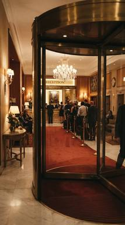 | 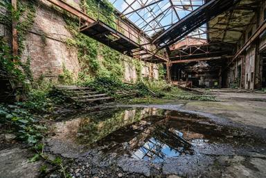 | 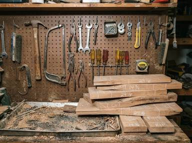 |
| Medium shot of an office cluster with green desks and binder stacks.<br>`people` `setting:commercial` `lighting:natural` `tidiness:cluttered` | A view from the entrance doors shows guests lining up on a red carpet.<br>`people` `setting:commercial` `lighting:artificial` `tidiness:tidy` | A low angle shot focusing on puddle reflections in a sunlit warehouse atrium with a collapsed catwalk.<br>`no_people` `setting:commercial` `lighting:natural` `tidiness:cluttered` | A tight crop of a 1970s workshop pegboard wall with flash lighting highlighting wood offcuts.<br>`no_people` `setting:residential` `lighting:artificial` `tidiness:cluttered` |

An edit chain — one base image and three edits, each applied to the base or to
an earlier turn:

| | | | |
|---|---|---|---|
| 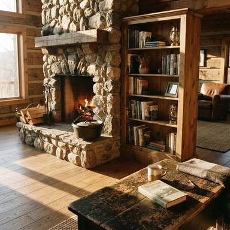 | 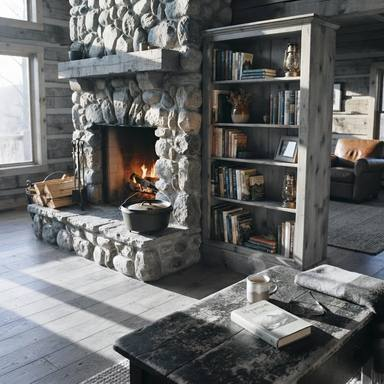 | 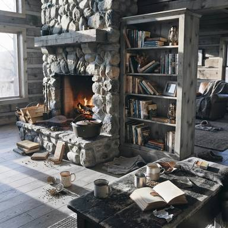 | 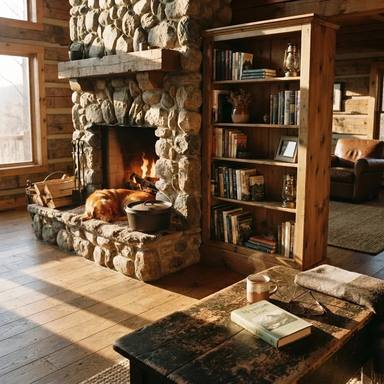 |
| **base image** | *edit 1 of turn 0*<br>Change the wood tones from warm pine to cool grey-washed wood. | *edit 2 of turn 1*<br>Make the space significantly messier with scattered books and cups. | *edit 3 of turn 0*<br>Add a sleeping dog on the rug near the hearth. |

## Outdoor Scenes

`liquidrandom.outdoor_scene()` — 20,371 images.
Tags: `people`, `no_people`, `setting:urban`, `setting:rural`, `setting:nature`, `time:day`, `time:night`, `time:dawn_dusk`, `weather:clear`, `weather:overcast`, `weather:rain`, `weather:snow`, `weather:fog`

| | | | |
|---|---|---|---|
| 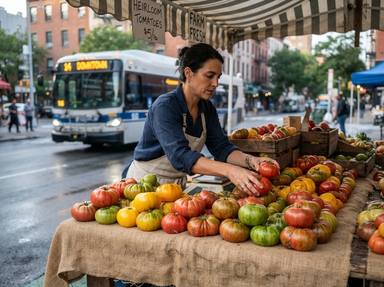 | 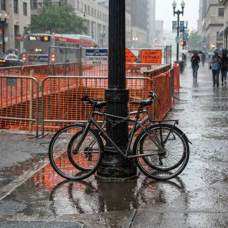 | 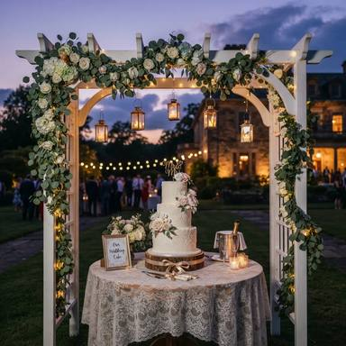 | 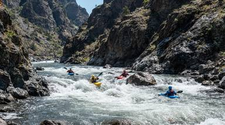 |
| A vendor arranges heirloom tomatoes at a stall with a city bus visible in the background.<br>`people` `setting:urban` `time:dawn_dusk` `weather:clear` | Bicycle rack and lamp post in front of orange safety netting with puddles on the ground.<br>`people` `setting:urban` `time:day` `weather:rain` | A wedding cake table stands under a white arch on the lawn at dusk.<br>`no_people` `setting:rural` `time:dawn_dusk` `weather:clear` | Distant view of kayakers in a technical rapid section.<br>`people` `setting:nature` `time:day` `weather:clear` |

An edit chain — one base image and three edits, each applied to the base or to
an earlier turn:

| | | | |
|---|---|---|---|
| 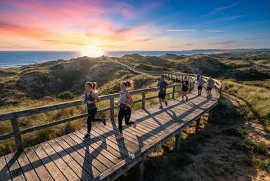 | 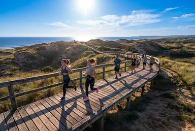 | 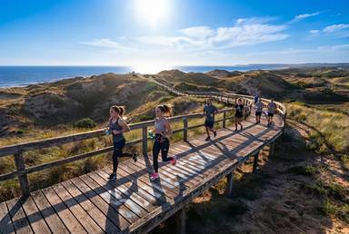 | 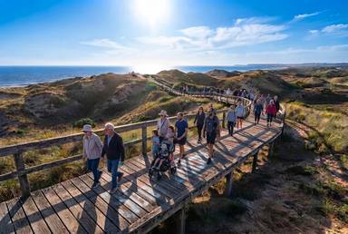 |
| **base image** | *edit 1 of turn 0*<br>Change the time of day to high noon with the sun directly overhead casting minimal shadows. | *edit 2 of turn 1*<br>Add a white 'Dune Protection' stenciled message painted on the boardwalk surface in the foreground. | *edit 3 of turn 2*<br>Increase the number of people to a moderate flow of walkers replacing the joggers. |

## Satellite & Aerial Views

`liquidrandom.aerial_view()` — 20,340 images.
Tags: `view:satellite`, `view:drone`, `view:aircraft`, `terrain:urban`, `terrain:agricultural`, `terrain:forest`, `terrain:water`, `terrain:desert`, `terrain:mountain`, `time:day`, `time:night`

| | | | |
|---|---|---|---|
| 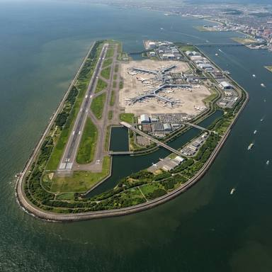 | 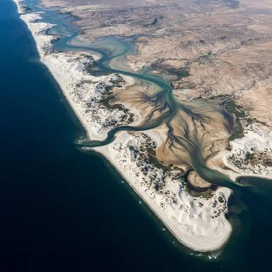 | 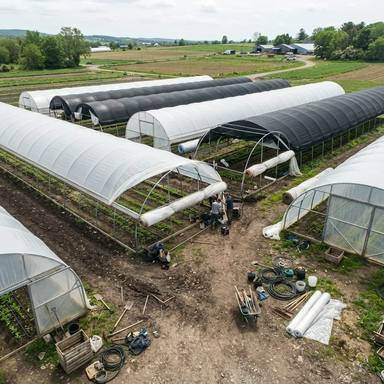 | 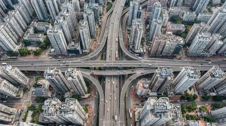 |
| A top-down satellite view of an artificial island airport with green perimeter landscaping.<br>`view:satellite` `terrain:water` `time:day` | A satellite image of an arid sandy barrier chain with stark sediment patterns.<br>`view:satellite` `terrain:desert` `time:day` | Drone view of greenhouse maintenance with rolled plastic covers.<br>`view:drone` `terrain:agricultural` `time:day` | Satellite imagery displays a multi-layered highway cutting through a dense grid of high-rises under midday sun.<br>`view:satellite` `terrain:urban` `time:day` |

An edit chain — one base image and three edits, each applied to the base or to
an earlier turn:

| | | | |
|---|---|---|---|
| 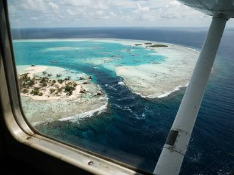 | 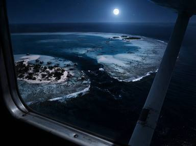 | 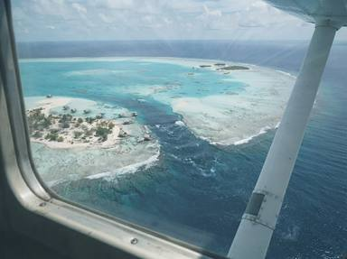 | 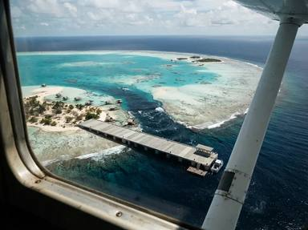 |
| **base image** | *edit 1 of turn 0*<br>Change the lighting to night time, darkening the ocean and highlighting reef textures with moonlight. | *edit 2 of turn 0*<br>Add a layer of thin cirrus haze over the entire scene. | *edit 3 of turn 0*<br>Add a new concrete pier extending from the western sandbank into the channel. |

## Agricultural Images

`liquidrandom.agriculture()` — 20,357 images.
Tags: `people`, `no_people`, `subject:crops`, `subject:livestock`, `subject:machinery`, `subject:pests`, `subject:infrastructure`, `season:spring`, `season:summer`, `season:autumn`, `season:winter`

| | | | |
|---|---|---|---|
| 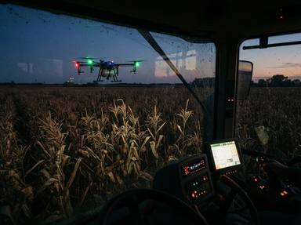 | 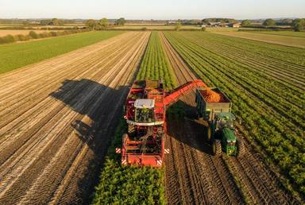 | 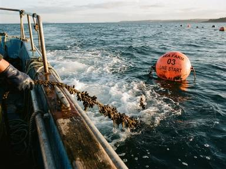 | 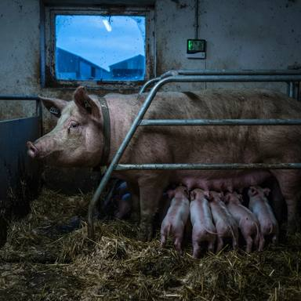 |
| A blue drone is observed from inside a tractor cab while operating near mature corn at dusk.<br>`no_people` `subject:machinery` `season:autumn` | Aerial view of the harvester moving along rows with clean carrots on the conveyor.<br>`no_people` `subject:crops` `season:autumn` | A side view from the boat gunwale shows the seed rope entering the water near an orange buoy.<br>`people` `subject:infrastructure` `season:summer` | Profile view of a sow nursing piglets during twilight with blue ambient light.<br>`no_people` `subject:livestock` `season:autumn` |

An edit chain — one base image and three edits, each applied to the base or to
an earlier turn:

| | | | |
|---|---|---|---|
| 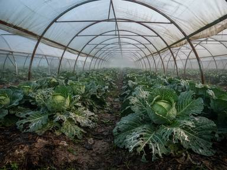 | 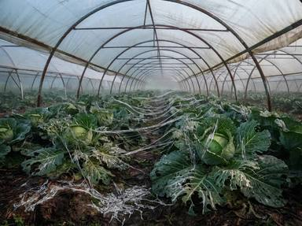 | 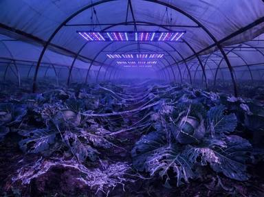 | 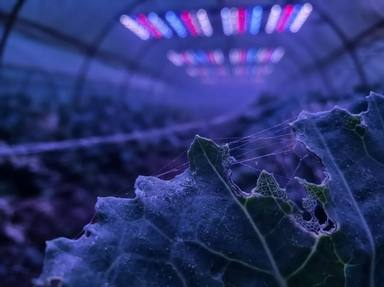 |
| **base image** | *edit 1 of turn 0*<br>Add heavy accumulations of dried slime trails connecting multiple leaves across the row. | *edit 2 of turn 1*<br>Change the lighting from natural dawn light to artificial purple and blue LED grow lights suspended above the plants. | *edit 3 of turn 2*<br>Change the camera angle from an eye-level row view to an extreme macro close-up of a single leaf margin. |

## Factory & Industrial Images

`liquidrandom.industrial()` — 20,060 images.
Tags: `people`, `no_people`, `subject:machinery`, `subject:robots`, `subject:assembly_line`, `subject:warehouse`, `subject:exterior`, `lighting:natural`, `lighting:artificial`, `lighting:dim`

| | | | |
|---|---|---|---|
| 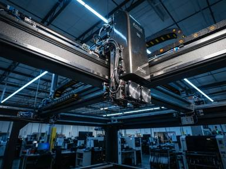 | 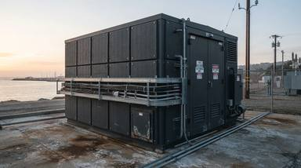 | 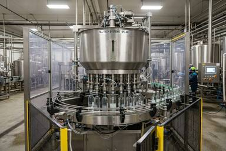 | 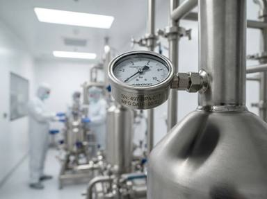 |
| A low-angle view captures the gantry beam of an SMT machine under blue industrial lighting.<br>`no_people` `subject:machinery` `lighting:artificial` | Dark charcoal turbine enclosure at a coastal utility station during dawn.<br>`no_people` `subject:exterior` `lighting:natural` | A wide view of a bottling line capping assembly with a stainless steel filler bowl and safety fencing.<br>`people` `subject:assembly_line` `lighting:artificial` | Angled close-up of a pressure gauge interface with serial number engraving under sterile white light.<br>`people` `subject:machinery` `lighting:artificial` |

An edit chain — one base image and three edits, each applied to the base or to
an earlier turn:

| | | | |
|---|---|---|---|
| 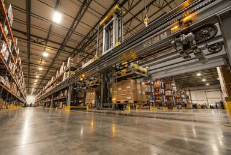 | 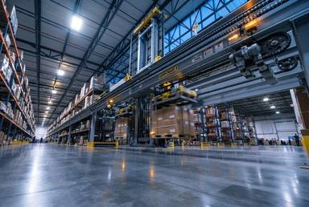 | 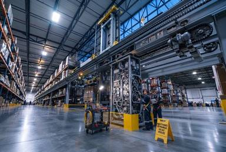 | 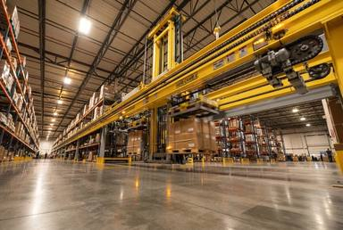 |
| **base image** | *edit 1 of turn 0*<br>Change the time of day to dawn, with cool blue natural light mixing with the warm artificial interior lights through high windows. | *edit 2 of turn 1*<br>Change the machine state to under maintenance with the side access panels removed and internal wiring exposed. | *edit 3 of turn 0*<br>Change the dominant color of the crane body from industrial grey to bright safety yellow. |

## Automotive Images

`liquidrandom.automotive()` — 20,258 images.
Tags: `people`, `no_people`, `view:exterior`, `view:in_cabin`, `view:road`, `view:traffic`, `time:day`, `time:night`, `time:dawn_dusk`

| | | | |
|---|---|---|---|
| 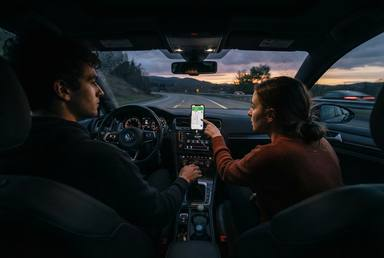 | 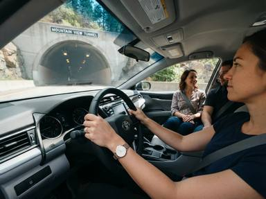 | 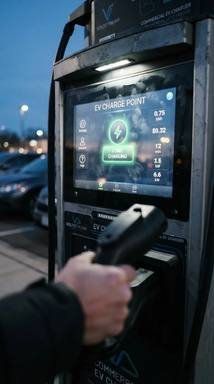 | 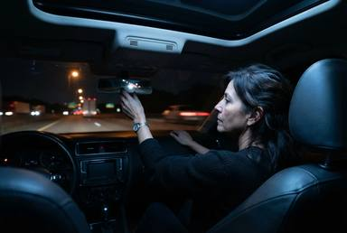 |
| A wide shot from the dashboard shows the passenger pointing at the route during twilight.<br>`people` `view:in_cabin` `time:dawn_dusk` | Daylight interior view of a driver and passengers approaching a tunnel entrance.<br>`people` `view:in_cabin` `time:day` | A close-up highlights the charging station touchscreen interface with a blurred hand holding the plug in the foreground.<br>`people` `view:exterior` `time:dawn_dusk` | Driver adjusting mirror under moonlight and street lamps with dark dashboard.<br>`people` `view:in_cabin` `time:night` |

An edit chain — one base image and three edits, each applied to the base or to
an earlier turn:

| | | | |
|---|---|---|---|
| 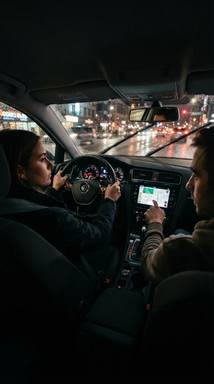 | 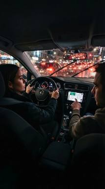 |  | 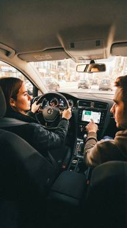 |
| **base image** | *edit 1 of turn 0*<br>Change the visible traffic outside to congested heavy traffic with brake lights glowing. | *edit 2 of turn 0*<br>Change the weather to a clear sunny day with bright natural lighting. | *edit 3 of turn 2*<br>Apply realistic capture artifacts including motion blur and high ISO noise. |

## UI & UX Screenshots

`liquidrandom.ui_screenshot()` — 20,367 images.
Tags: `platform:mobile`, `platform:desktop`, `platform:tablet`, `theme:light`, `theme:dark`, `ui_state:normal`, `ui_state:error`, `ui_state:empty`, `ui_state:loading`

| | | | |
|---|---|---|---|
| 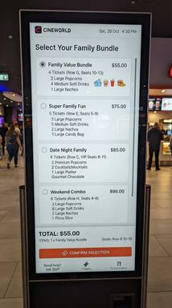 |  |  |  |
| A mobile-view kiosk screen listing family bundle packages vertically.<br>`platform:mobile` `theme:light` `ui_state:normal` | A white background dashboard with purple accents and a confidence interval band on the scatter plot.<br>`platform:desktop` `theme:light` `ui_state:normal` | A dark theme mobile screen illustrating USB-C key insertion with a timeout counter.<br>`platform:mobile` `theme:dark` `ui_state:normal` | Dark mode tablet library showing recently added and favorite books.<br>`platform:tablet` `theme:dark` `ui_state:normal` |

An edit chain — one base image and three edits, each applied to the base or to
an earlier turn:

| | | | |
|---|---|---|---|
| 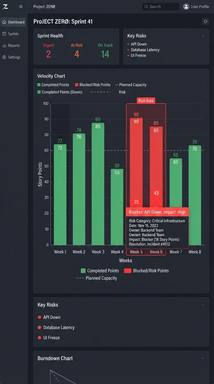 | 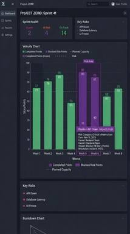 | 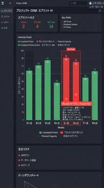 |  |
| **base image** | *edit 1 of turn 0*<br>Change the high contrast red accents to a deep purple color scheme for the chart bars and alerts. | *edit 2 of turn 0*<br>Translate all visible UI text and tooltip content into Japanese characters. | *edit 3 of turn 2*<br>Switch the view to an empty state showing a 'No Data Available' illustration in the center. |

## Documents & OCR

`liquidrandom.document()` — 20,222 images.
Tags: `medium:printed`, `medium:handwritten`, `medium:mixed`, `capture:scan`, `capture:photo`, `quality:clean`, `quality:degraded`

| | | | |
|---|---|---|---|
|  |  |  |  |
| A light gray shipping label on beige cardboard with a torn 2D barcode and grease residue.<br>`medium:printed` `capture:photo` `quality:degraded` | A scanned corporate invoice featuring bilingual English and Arabic text with double-line borders.<br>`medium:printed` `capture:scan` `quality:clean` | A close-up photo of an amended tax return calculation section.<br>`medium:mixed` `capture:photo` `quality:clean` | A crumpled diary note on blue-lined paper under fluorescent lighting.<br>`medium:handwritten` `capture:photo` `quality:degraded` |

An edit chain — one base image and three edits, each applied to the base or to
an earlier turn:

| | | | |
|---|---|---|---|
|  |  |  |  |
| **base image** | *edit 1 of turn 0*<br>Shift the camera perspective to a low angle looking up at the signage, emphasizing the height of the wall and the sky background. | *edit 2 of turn 0*<br>Translate all menu text to French and convert currency values from USD to Euro, adapting item names to local cuisine terms. | *edit 3 of turn 2*<br>Apply digital noise and fading effects to simulate a low-resolution scan, reducing overall sharpness and contrast. |

## Charts & Diagrams

`liquidrandom.chart()` — 20,295 images.
Tags: `form:bar`, `form:line`, `form:pie`, `form:scatter`, `form:flowchart`, `form:table`, `form:infographic`, `form:diagram`, `style:clean`, `style:hand_drawn`

| | | | |
|---|---|---|---|
|  |  |  |  |
| A scientific scatter plot comparing drug clearance against weight separated by patient gender.<br>`form:scatter` `style:clean` | A network graph diagram illustrating transit times from multiple farms to a central quality hub.<br>`form:diagram` `style:clean` | A clean vertical grouped bar chart showing quarterly sales across five regions with growth annotations.<br>`form:bar` `style:clean` | A donut-style pie chart showing wearable unit share with percentages inside slices.<br>`form:pie` `style:clean` |

An edit chain — one base image and three edits, each applied to the base or to
an earlier turn:

| | | | |
|---|---|---|---|
|  |  |  |  |
| **base image** | *edit 1 of turn 0*<br>Render the chart in a hand-drawn whiteboard style with sketchy lines and marker-like textures. | *edit 2 of turn 1*<br>Adjust the data values to reflect Q1 2024 capacity figures and update the central total to 475 GWh. | *edit 3 of turn 0*<br>Add a new data series segment for 'Northvolt' with 5% share and update the legend accordingly. |

## Retail & Products

`liquidrandom.retail_product()` — 20,499 images.
Tags: `people`, `no_people`, `presentation:studio`, `presentation:shelf`, `presentation:packaging`, `presentation:lifestyle`

| | | | |
|---|---|---|---|
|  |  |  |  |
| High-angle view of luxury satin gowns on a boutique rack under ambient lighting.<br>`no_people` `presentation:shelf` | Brightly lit retail end-cap displaying smart home hubs and sorted LED bulb boxes.<br>`people` `presentation:shelf` | A reclaimed wood veneer convertible bed and desk unit is shown under overcast daylight with linoleum flooring.<br>`no_people` `presentation:studio` | A reflection shot of silver cylindrical boxes on a copper counter with a digital display.<br>`people` `presentation:packaging` |

An edit chain — one base image and three edits, each applied to the base or to
an earlier turn:

| | | | |
|---|---|---|---|
|  |  |  |  |
| **base image** | *edit 1 of turn 0*<br>Add a closed silver laptop to the center of the glass desk surface. | *edit 2 of turn 0*<br>Change the stock level on the bookshelf to appear messy and disorganized. | *edit 3 of turn 0*<br>Add a person standing behind the desk looking at the bookshelf. |

## Food & Cooking

`liquidrandom.food()` — 20,004 images.
Tags: `people`, `no_people`, `stage:raw`, `stage:cooking`, `stage:plated`, `setting:home`, `setting:restaurant`, `setting:studio`

| | | | |
|---|---|---|---|
|  |  |  |  |
| Ossobuco served in a cast iron pot with a spoon scooping marrow in a home kitchen.<br>`no_people` `stage:plated` `setting:home` | A night market display of tropical fruits under fluorescent lights with visible steam.<br>`people` `stage:raw` `setting:restaurant` | A chef stretches pizza dough outdoors near a brick oven during golden hour.<br>`people` `stage:cooking` `setting:restaurant` | An eye-level view of a chef garnishing a scallop in a warm restaurant kitchen.<br>`people` `stage:plated` `setting:restaurant` |

An edit chain — one base image and three edits, each applied to the base or to
an earlier turn:

| | | | |
|---|---|---|---|
|  |  |  |  |
| **base image** | *edit 1 of turn 0*<br>Change the whole wheat dough to white sourdough dough with a lighter color. | *edit 2 of turn 0*<br>Add a dusting of rice flour on top of the dough instead of plain wheat flour. | *edit 3 of turn 2*<br>Change the twilight blue hour lighting to bright midday sun. |

